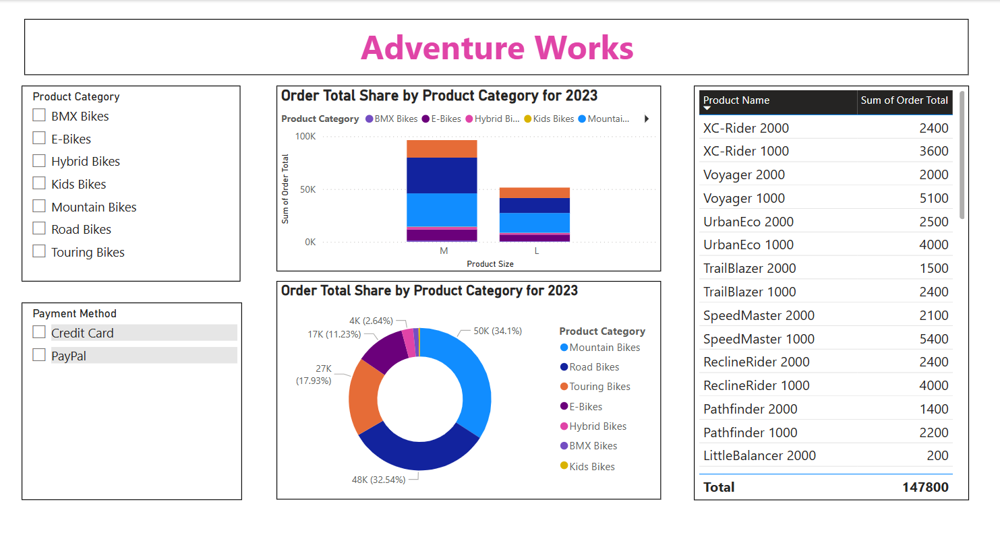

# Power BI Project: [Adventure works data analysis]

## 📊 Project Overview

This Power BI project, **[Adventure Works]**, was developed to analyze and visualize data related to **To perform a comprehensive analysis of a fictional multinational manufacturing company. The goal is to uncover business insights across Sales, Customer Behavior, Product Performance, and Geography through interactive Power BI dashboards.

## ✅ Objectives

- [Objective 1, e.g., Understand sales trends across regions]
- [Objective 2, e.g., Identify top-performing products and sales reps]
- [Objective 3, e.g., Monitor KPIs in real-time]

## 📁 Project Structure

## 🧩 Tools & Technologies

- **Power BI Desktop**
- **DAX (Data Analysis Expressions)**
- **Power Query**
- **Excel / SQL** (for data preprocessing if applicable)

## 📈 Key Features

- Interactive dashboards with slicers and filters
- KPI visualizations (e.g., revenue, growth rate, conversion)
- Custom DAX measures and calculated columns
- Drill-through and tooltip reports
- Geo-maps and trend analysis

## 📷 Dashboard Previews

## Table Columns

<table style="width:100%">
<thead>
<tr>
<th style="text-align:center; font-weight: bold; font-size:20px">Columns Name</th>
<th style="text-align:center; font-weight: bold; font-size:20px">Description of Each Columns</th>
</tr>
</thead>
<table>
    <tr>
        <td>Product ID</td>
        <td>Unique identifier for each product.</td>
    </tr>
    <tr>
        <td>Product Category </td>
        <td>Broad classification of the product (e.g., Electronics, Clothing).</td>
    </tr>
    <tr>
        <td>Product Subcategory</td>
        <td>More specific classification under the main category.</td>
    </tr>
    <tr>
        <td>Product Name</td>
        <td>Name or title of the product.</td>
    </tr>
    <tr>
        <td>Product Description</td>
        <td>Brief details or features of the product.</td>
    </tr>
    <tr>
        <td>Product Price</td>
        <td>Selling price of the product.</td>
    </tr>
    <tr>
        <td>Product Weight</td>
        <td>Weight of the product, typically in grams or kilograms.</td>
    </tr>
    <tr>
        <td>Product Size</td>
        <td>Dimensions or sizing details (e.g., S, M, L or 10x10 cm).</td>
    </tr>
    <tr>
        <td>Order ID</td>
        <td>Unique identifier for each order.</td>
    </tr>
    <tr>
        <td>Customer ID</td>
        <td>Unique identifier for each customer.</td>
    </tr>
    <tr>
        <td>Order Date</td>
        <td>Date when the order was placed.</td>
    </tr>
    <tr>
        <td>Order Status</td>
        <td>Current status of the order (e.g., Shipped, Delivered, Pending).</td>
    </tr>
    <tr>
        <td>Order Quantity</td>
        <td>Number of units ordered for a product.</td>
    </tr>
    <tr>
        <td>Order Total</td>
        <td>Total amount paid for the order.</td>
    </tr>
    <tr>
        <td>Payment Method</td>
        <td>Mode of payment used (e.g., Credit Card, PayPal, Cash).</td>
    </tr>
</table>

## 🚀 Getting Started

1. Clone the repository or download the `Generate a visualization.pbix` file
2. Open the `Generate a visualization.pbix` file using **Power BI Desktop**
3. If necessary, update the data source path
4. Refresh the dataset and explore the report

## 📌 Notes

- Publicly data available is used, for demonstration purposes only.
- Ensure required permissions if connecting to external databases.

## 👤 Author

**[Your Name]**  
[LinkedIn](https://linkedin.com/in/hariom2024niper) | [Email](mailto:phariom.niper2024@email.com)

## 📄 License

This project is licensed under the MIT License - see the [LICENSE](LICENSE) file for details.
